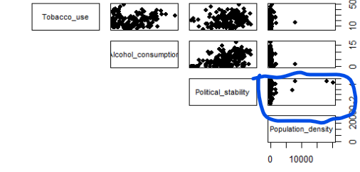

---
output:
  pdf_document: default
  html_document: default
---
<center>

<h1>

STAT 360: Computational Statistics and Data Analysis

<h2>Project - EDA</h2>

<h4>Matt Lao & Adam Bihi</h4>

</center>

### Load Relevant R Libraries

```{r warning=FALSE, message=FALSE}
library(rmarkdown); library(knitr); library(moments); 
library(scatterplot3d); library(corrplot); library(pso)
library(psych); library(GPArotation); library(lavaan); library(readxl); library(dplyr)
```

### Matrix Construction

```{r}
data_matrix_csv <- read.csv("C:/Users/User/OneDrive - University of St. Thomas/Classes/STAT360/STAT360 Project/data/Data Matrix.csv", row.names=1)
life_expectancy <- as.matrix(data_matrix_csv)

col_names_unedited <- c(
  "Life expectancy at birth, total (years)",
  "CO2 emissions (metric tons per capita)",
  "Access to electricity (% of population)",
  "Current health expenditure (% of GDP)",
  "Out-of-pocket expenditure (% of current health expenditure)",
  "Domestic private health expenditure per capita, PPP (current international $)",
  "Domestic general government health expenditure per capita, PPP (current international $)",
  "Renewable internal freshwater resources per capita (cubic meters)",
  "Prevalence of HIV, total (% of population ages 15-49)",
  "Unemployment, total (% of total labor force) (national estimate)",
  "Government Effectiveness: Estimate",
  "Income share held by highest 10%",
  "Prevalence of current tobacco use (% of adults)",
  "Total alcohol consumption per capita (liters of pure alcohol, projected estimates, 15+ years of age)",
  "Political Stability and Absence of Violence/Terrorism: Estimate",
  "Population density (people per sq. km of land area)"
)

# Better for displaying
col_names <- c(
  "Life_expectancy",
  "CO2_emissions",
  "Electricity",
  "Health_expenditure",
  "Out_of_pocket",
  "Private_health_expenditure",
  "Govt_health_expenditure",
  "Freshwater_resources",
  "HIV_prevalence",
  "Unemployment",
  "Govt_effectiveness",
  "Income_share",
  "Tobacco_use",
  "Alcohol_consumption",
  "Political_stability",
  "Population_density"
)

colnames(life_expectancy) <- col_names
```

------------------------------------------------------------------------

### Central Tendency

The following are the means for all our countries across each dimension.

```{r}
mean_values <- apply(life_expectancy, 2, mean, na.rm = TRUE)
mean_values
```

------------------------------------------------------------------------

### Dispersion

The following are our standard deviations for all our dimensions.

```{r}
sd_values <- apply(life_expectancy, 2, sd, na.rm = TRUE)
sd_values
```

------------------------------------------------------------------------

### Shape

[Kurtosis]{.underline}

```{r}
kurtosis_values <- apply(life_expectancy, 2, kurtosis, na.rm = TRUE)
kurtosis_values
```

[Skewness]{.underline}

```{r}
skewness_values <- apply(life_expectancy, 2, skewness, na.rm = TRUE)
skewness_values
```

[Stripcharts]{.underline}

```{r}
for (col in colnames(life_expectancy)) {
  stripchart(life_expectancy[, col], method = "stack", xlab = col)
}
```

------------------------------------------------------------------------

### Variance-Covariance Matrix

```{r}
cov(life_expectancy, use = "pairwise.complete.obs")
```

------------------------------------------------------------------------

### Correlation Matrix

```{r}
corr_life_expectancy <- cor(life_expectancy, use = "pairwise.complete.obs")
corr_life_expectancy
```

------------------------------------------------------------------------

### Scatterplot Matrix

```{r}
pairs(life_expectancy, pch = 16, lower.panel = NULL)
```

------------------------------------------------------------------------

### Correlation Plot

```{r}
corrplot(corr_life_expectancy, method = "square")
```

------------------------------------------------------------------------

### Likely Outliers

The following is the concept we followed when identifying outliers.

1.  Find a pair of dimensions that appear to have outliers on the **Scatterplot Matrix.**

    

    *Here it appears that Population Density and Political Stability have a few outliers.*

2.  Find the Mahalanobis Distances for every row between those dimensions.

    ```{r}
    # dimension 1 
    dim1 <- "Private_health_expenditure"  # CHANGE THIS
    # dimension 2
    dim2 <- "Income_share" # CHANGE THIS
    # pair of dimensions
    pair_dims <- c(dim1, dim2)

    # all rows between the pairs of dimensions
    rows_pair_dims <- life_expectancy[,pair_dims]
    # centroid
    centroid <- c(mean(life_expectancy[,dim1], na.rm = TRUE), 
                  mean(life_expectancy[,dim2], na.rm = TRUE))
    # covariance matrix between dimensions
    cov_pair_dims <- cov(life_expectancy[,pair_dims], use = "pairwise.complete.obs")

    # mahalanobis distance for each row between these dimensions
    m_dims <- mahalanobis(x = rows_pair_dims, 
                          center = centroid, 
                          cov = cov_pair_dims)

    ```

3.  Compare the Mahalanobis Distances for every row to the critical value to find the outliers.

    ```{r}
    # our constant critical value
    critical_value <- qchisq(p = 1 - 0.001, df = 2)

    # find which Mahalanobis distances for every row to the critical value
    outlierIndicies <- which(m_dims>critical_value)
    m_dims[outlierIndicies]
    ```

4.  Find the correlation matrices for our pair of dimensions with and without each outlier to see if it is significant.

    ```{r}
    for (outlier in outlierIndicies) {
       cor_with <- cor(life_expectancy[,pair_dims], 
                       use = "pairwise.complete.obs")
       cor_without <- cor(life_expectancy[-outlier, pair_dims], 
                          use = "pairwise.complete.obs")
       print(rownames(life_expectancy)[outlier])
       print(cor_with)
       print(cor_without)
       cat('\n')
       cat('\n')
    }
    ```

------------------------------------------------------------------------

### Find All Outliers

The following takes the idea above and does it for all pairs of dimension (however a bit redundantly).

```{r}
outlier_matrix <- matrix(nrow = 0, ncol = 4)
colnames(outlier_matrix) <- c("Country", "dim1", "dim2", "MD")
```

```{r}
for (i in col_names) {
  other_col_names <- col_names[col_names != i]
  for (j in other_col_names) {
    # dimension 1
    dim1 <- i
    # dimension 2
    dim2 <- j
    # pair of dimensions
    pair_dims <- c(dim1, dim2)

    # all rows between the pairs of dimensions
    rows_pair_dims <- life_expectancy[,pair_dims]
    # centroid
    centroid <- c(mean(life_expectancy[,dim1], na.rm = TRUE), 
                  mean(life_expectancy[,dim2], na.rm = TRUE))
    # covariance matrix between dimensions
    cov_pair_dims <- cov(life_expectancy[,pair_dims], use = "pairwise.complete.obs")

    # mahalanobis distance for each row between these dimensions
    m_dims <- mahalanobis(x = rows_pair_dims, 
                          center = centroid, 
                          cov = cov_pair_dims)
    # our constant critical value
    critical_value <- qchisq(p = 1 - 0.001, df = 2)

    # find which Mahalanobis distances for every row to the critical value
    outlierIndicies <- which(m_dims>critical_value)
    m_dims[outlierIndicies]
    
    for (outlier in outlierIndicies) {
      country <- rownames(life_expectancy)[outlier]
      m_dist <- m_dims[outlier]
      outlier_matrix <- rbind(outlier_matrix, c(country, dim1, dim2, m_dist))
      cor_with <- cor(life_expectancy[,pair_dims], 
                   use = "pairwise.complete.obs")
      cor_without <- cor(life_expectancy[-outlier, pair_dims], 
                          use = "pairwise.complete.obs")
      change <- abs(cor_with[2,1]-cor_without[2,1])
      if (change > 0.3) {
        cat(sprintf("%s is an influetial outlier for the dimensions %s and %s as the correlation changes by %.3f", country, dim1, dim2, change))
        cat('\n')
        cat('\n')
      }
    }
  }
}
```

We have many outliers in the following matrix, but several that are redundant. We attempted to avoid this but are unsure how to achieve this. However it is of note that none of these outliers were actually found to be influential based on the code we wrote.

```{r}
outlier_matrix
```
